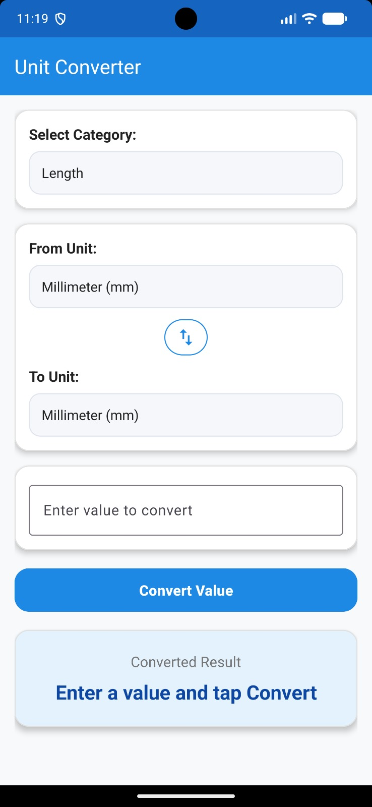
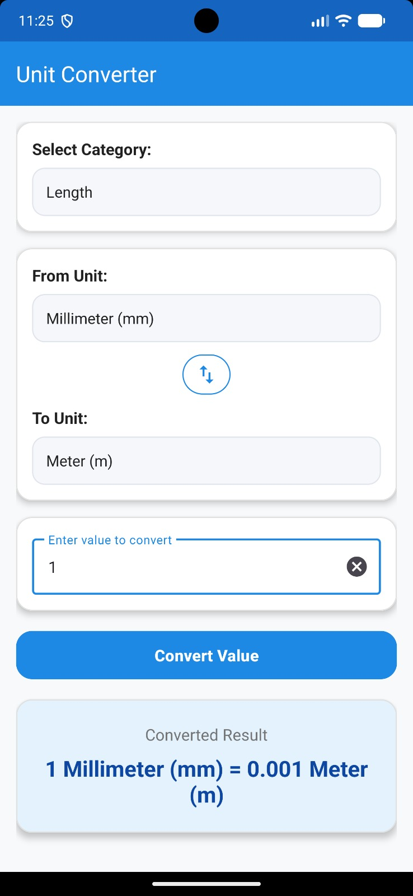
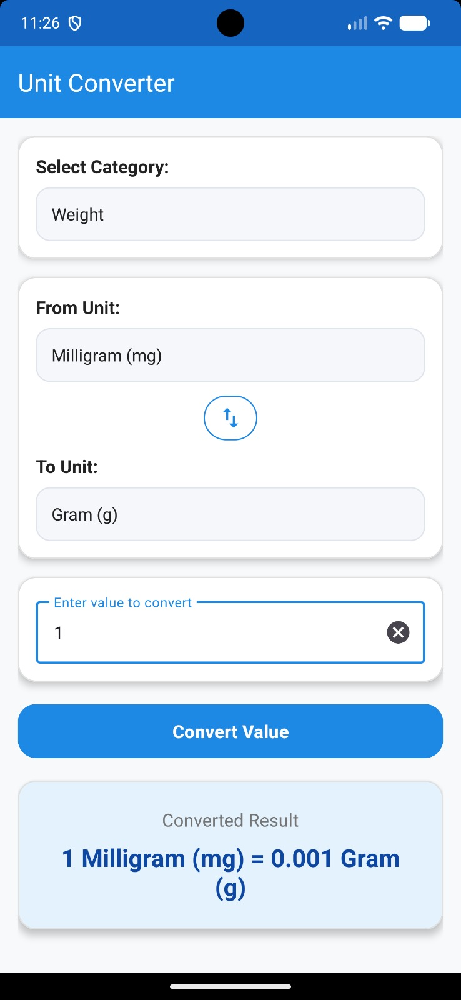
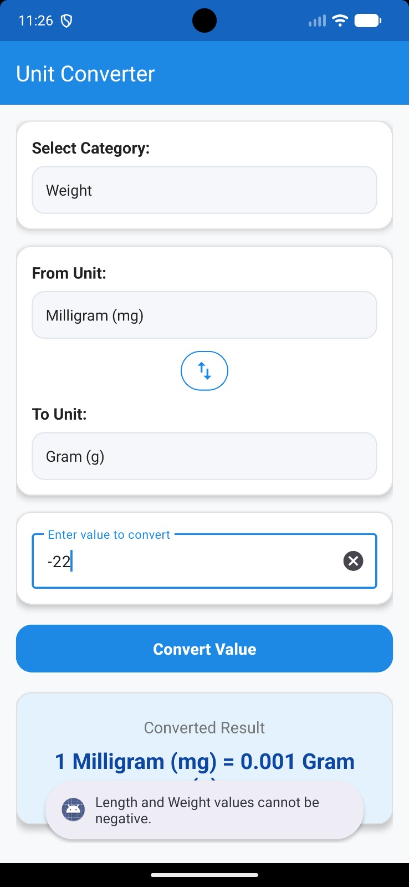

# Unit Converter Application

An offline-first, production-grade Android application built with **Java** and **Material Design 3 Components** for converting values across multiple measurement categories. Developed as Task 1 for the **Oasis InfoByte Internship Program (OIBSIP)** under the `OIBSIP-Android` repository.

---

## 📱 Features

- ✔ **Numeric Input Handling**: Supports positive and signed decimal values via `TextInputEditText`.
- ✔ **Dynamic Category Selection**: Switch seamlessly between 3 primary categories:
  - **Length**: Millimeter, Centimeter, Meter, Kilometer, Inch, Foot, Mile
  - **Weight**: Milligram, Gram, Kilogram, Ounce, Pound
  - **Temperature**: Celsius (°C), Fahrenheit (°F), Kelvin (K)
- ✔ **Automatic Dropdown Synchronization**: Source and Target unit Spinners repopulate dynamically whenever the Category changes.
- ✔ **Base-Unit Normalization Engine**: $O(1)$ fast computation leveraging base-unit conversion maps (Meters for length, Grams for weight).
- ✔ **Strict Toast Validation System**:
  - Rejects empty input strings
  - Rejects invalid numerical entries
  - Prevents negative values in physical dimensions (Length/Weight)
  - Enforces thermodynamic absolute zero boundaries ($-273.15^\circ\text{C}$ / $0\text{ K}$ / $-459.67^\circ\text{F}$)
  - Protects against double precision overflow ($> 10^{12}$)
- ✔ **Scientific Number Formatting**: Formats converted values cleanly without floating-point representation artifacts.

---

## 🛠 Tech Stack & Specifications

- **Language**: Java 8
- **UI Framework**: XML Layouts with Material Design 3 Components
- **Architecture**: Decoupled Layered Architecture (MVC / MVP Lite)
- **Minimum SDK**: API 24 (Android 7.0 Nougat)
- **Target / Compile SDK**: API 34
- **Build System**: Gradle 8.2 with AndroidX

---

## 📂 Repository Folder Structure

```
Unit_Converter/
├── README.md
├── Screenshots/
│   └── .gitkeep
└── UnitConverterApp/
    ├── build.gradle (Project)
    ├── settings.gradle
    └── app/
        ├── build.gradle (Module)
        └── src/
            ├── test/
            │   └── java/com/aditya/unitconverter/
            │       ├── UnitConverterLogicTest.java
            │       └── ValidationHelperTest.java
            └── main/
                ├── AndroidManifest.xml
                ├── java/com/aditya/unitconverter/
                │   ├── activity/MainActivity.java
                │   ├── constants/AppConstants.java
                │   ├── helper/
                │   │   ├── UnitConverterLogic.java
                │   │   ├── ValidationHelper.java
                │   │   └── ValidationResult.java
                │   ├── model/
                │   │   ├── Category.java
                │   │   └── Unit.java
                │   └── utils/FormatterUtils.java
                └── res/
                    ├── drawable/
                    ├── layout/activity_main.xml
                    └── values/
                        ├── arrays.xml
                        ├── colors.xml
                        ├── dimens.xml
                        ├── strings.xml
                        └── styles.xml
```

---

## ⚙️ Installation & Setup Guide

1. **Clone the Repository**:
   ```bash
   git clone https://github.com/Aditya11o/OIBSIP-Android.git
   ```
2. **Open in Android Studio**:
   - Open Android Studio.
   - Select **Open an existing project**.
   - Navigate to `OIBSIP-Android/Unit_Converter/UnitConverterApp` and click **OK**.
3. **Build & Run**:
   - Sync project with Gradle files.
   - Run on an Android Emulator or connected physical device (Min SDK 24+).

---

## 🧪 Unit Testing

Run automated JUnit unit tests via terminal or Android Studio:
```bash
./gradlew test
```
- `UnitConverterLogicTest`: Validates length, weight, and temperature mathematical formulas.
- `ValidationHelperTest`: Validates input boundary rules and error handling.

---

## 📸 Application Screenshots

| Default UI State | Conversion Result State | Category Switch State | Validation Error State |
| :---: | :---: | :---: | :---: |
|  |  |  |  |

---

## 📜 License & Credits

Developed by **Aditya** for the **Oasis InfoByte Internship Program**.  
Released under the [MIT License](../../LICENSE).
